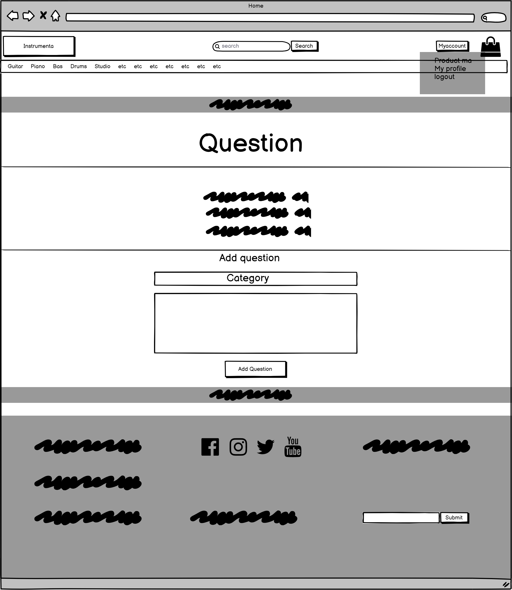
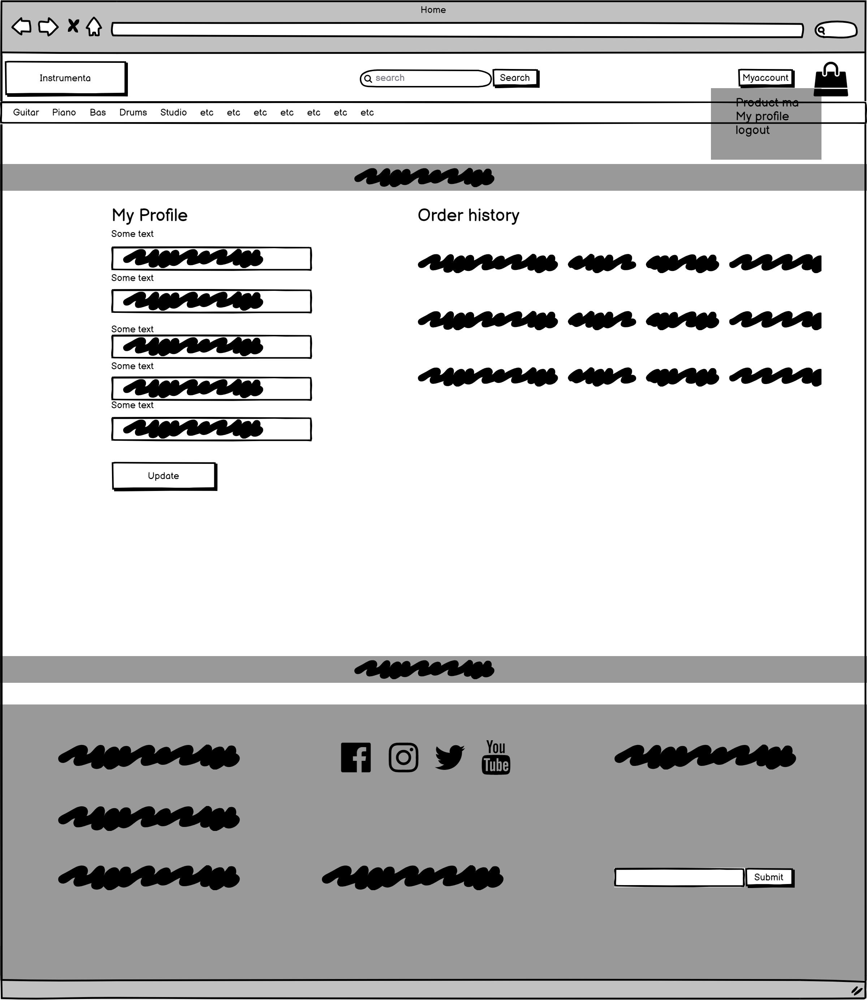
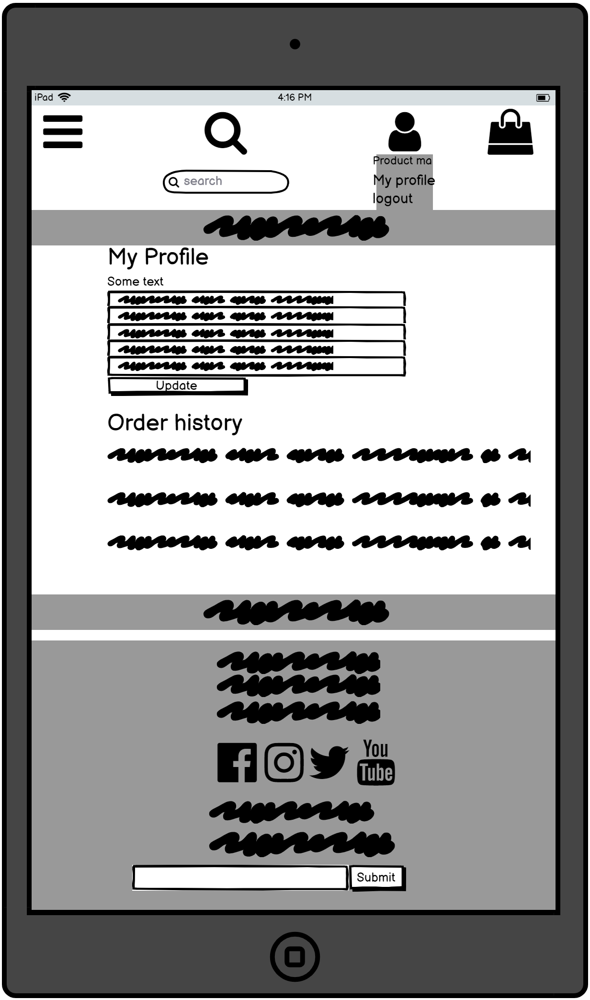
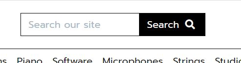
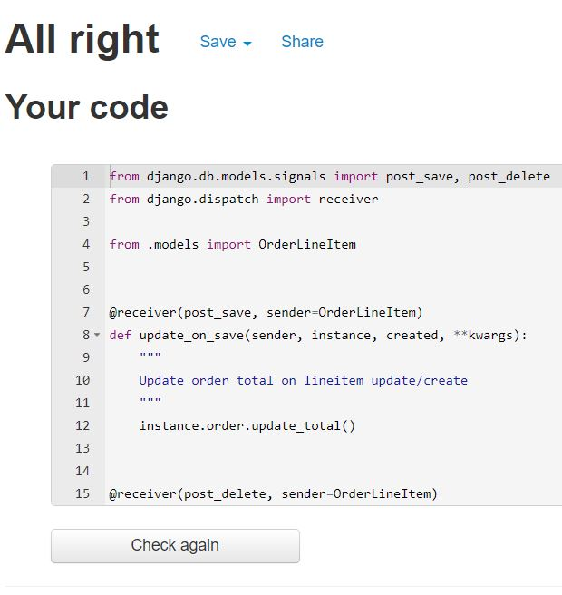

# Instrumenta

## Welcome to my Site [Instrumenta](https://instrumenta.herokuapp.com/)!

 

<!-- markdown-toc start - Don't edit this section. Run M-x markdown-toc-
refresh-toc -->

# Table of Content

1. [Project goals](#project-goals)

2. [User experience](#user-experience)

    1. [Target audience](#target-audience)

    2. [User stories](#user-stories)

    3. [Design](#design)

    4. [Technical design](#technical-design)

        1. [Wireframes](#wireframes)

        2. [Database diagram](#database-diagram)

3. [Features](#features)

4. [Technologies used](#technologies-used)

    1. [Languages](#languages)

    2. [Libraries and programs](#libraries-and-programs)

5. [Testing](#testing)

    1. [HTML](#html)

    2. [CSS](#css)

    3. [Python](#python)

    4. [Javascript](#javascript)

    5. [Accessibility](#accessibility)

    6. [Performance](#performance)

    7. [Further testing](#further-testing)

    8. [Testing user stories](#testing-user-stories)

6. [Bugs](#bugs)

7. [Deployment](#deployment)

8. [Credit](#credit)

    1. [Acknowledgement](#acknowledgement)

## Project goals

* The goal of this project is for the site owner to practice Django and implement a working ecommerce site.

## User experience

### Target audience

* This site is targeted towards musicians and beginners.

### User stories

#### Site Visitor

1. As a Site Visitor I can see pictures of instruments when I enter the page so that I know what kind of page I am on.

2. As a Site Visitor I can see music instrument categories so I can find the products I am interested in.

3. As a Site Visitor I can scroll thru a list of products so that I can find the product I want.

4. As a Site Visitor I can click on a product and see information about the product so I can get a better view of the product.

5. As a Site Visitor I can sort products so I can find the product I want.

6. As a Site Visitor I can search for products so I can find the relevant one for me.

7. As a Site Visitor I can add products to a bag so I can see everything I have added.

8. As a Site Visitor I can Update and Delete products in bag so I can Remove products I dont want.

9. As a Site Visitor I can add products to a bag so that I can buy them

10. As a Site Visitor I can buy a product so I can get the product I want.

11. As a Site Visitor I can get an email confirmation so I can feel confident the purchase is ok.

12. As a Site Visitor I can view an order confirmation so I can feel confident everything is ok.

13. As a Site Visitor I can browse the site and get notifications messages so I can know if things are working or not.

14. As a Site Visitor I can click on a button so that I can get to the top of the page quickly.

15. As a Site Visitor I can read reviews so that I can see which products customers are happy with.

16. As a Site Visitor I can create an account so that I can have personal info saved.

#### Site User

17. As a Site User I can log in to my account so that I can save my personal info.

18. As a Site User I can add a product to a wishlist so that I can keep track of products I want.

19. As a Site User I can delete a product from a wishlist so that I can remove products I dont want.

20. As a Site User I can log in to my account so that I can leave reviews.

21. As a Site User I can Delete my Review so that I can change my review or delete it if I want to.

22. As a Site User I can log in to my account so that I can Ask questions.

23. As a Site User I can view questions so that I can see what other people have had to say about the site.

#### Site Admin goals

24. As a Site Admin I can add, read, update and delete products so that I can manage the content.

25. As a Site Admin I can see all checkout orders so that I can see what people are buying.

26. As a Site Admin I can create, read, update and delete questions so that I can manage my content.

27. As a Site Admin I can create, read, update and delete reviews so that I can manage my content.

28. As a Site Admin I can manage the wishlist so that I can keep track of the wishlists.

29. As a Site Admin I can search for all my content so that I can find what I am interested in.

### Technical design

### Design

* A big part of my design inspiration came from the music site [Thomann](https://www.thomann.de/se/index.html). I also looked a lot on [Gear4music](https://www.gear4music.se/sv/). I also got a lot of inspiration and help from the study material *Boutique Ado* from [Code Institute](https://codeinstitute.net/se/).

#### Colors

* For the colors I wanted a grounded and basic look, letting the instruments speak for the page. Based on that i went with a white background with banners marking of some parts with stronger grey colors.

#### Fonts

* I chose the font [*Prompt*](https://fonts.google.com/specimen/Prompt?query=prompt) as it felt right for my page.

### Wireframes

* Below you can see the images of the wireframes

index.html

    

desktop

        
    

    

tablet

        
    

    

mobile

        
    

add_products.html

    

desktop

        
    

    

tablet

        
    

    

mobile

        
    

edit_products.html

    

desktop

        
    

    

tablet

        
    

    

mobile

        
    

product_detail.html

    

desktop

        
    

    

tablet

        
    

    

mobile

        
    

products.html

    

desktop

        
    

    

tablet

        
    

    

mobile

        
    

questions.html

    

desktop

        
    

    

tablet

        
    

    

mobile

        
    

wishlist.html

    

desktop

        
    

    

tablet

        
    

    

mobile

        
    

bag.html

    

desktop

        
    

    

tablet

        
    

    

mobile

        
    

checkout.html

    

desktop

        
    

    

tablet

        
    

    

mobile

        
    

checkout_success.html

    

desktop

        
    

    

tablet

        
    

    

mobile

        
    

404.html

    

desktop

        
    

    

tablet

        
    

    

mobile

        
    

profile.html

    

desktop

        
    

    

tablet

        
    

    

mobile

        
    

reset_password.html

    

desktop

        
    

    

tablet

        
    

    

mobile

        
    

login.html

    

desktop

        
    

    

tablet

        
    

    

mobile

        
    

logout.html

    

desktop

        
    

    

tablet

        
    

    

mobile

        
    

signup.html

    

desktop

        
    

    

tablet

        
    

    

mobile

        
    

### Database diagram

* The database has multiple models;
    * **Wishlist** / Custom model
    * **Review** / Custom model
    * **Question** / Custom model

* 

Database Diagram

## Features

* **Carousel**

* The opening of the site shows a carousel with instrument images
 

### User stories covered by this feature:

    1. As a Site Visitor I can see pictures of instruments when I enter the page so that I know what kind of page I am on.

* **Categories Nav**

* A feature was implemented to show a navbar with the instrument categories
 

### User stories covered by this feature:

    2. As a Site Visitor I can see music instrument categories so I can find the products I am interested in.

* **Product List**

* A feature was implemented to show a list of products to scroll thru
 

### User stories covered by this feature:

    3. As a Site Visitor I can scroll thru a list of products so that I can find the product I want.

* **Product Detail**

* A feature was implemented to show a single product 
 

### User stories covered by this feature:

    4. As a Site Visitor I can click on a product and see information about the product so I can get a better view of the product.

* **Sort**

* A feature was implemented so users can sort products
 

### User stories covered by this feature:

    5. As a Site Visitor I can sort products so I can find the product I want.

* **Search**

* A feature was implemented so users can search for products
 

### User stories covered by this feature:

    6. As a Site Visitor I can search for products so I can find the relevant one for me.

* **Add to bag**

* A feature was implemented so users can add products to bag
 

### User stories covered by this feature:

    7. As a Site Visitor I can add products to a bag so I can see everything I have added.
    9. As a Site Visitor I can add products to a bag so that I can buy them

* **Update and Delete products in bag**

* A feature was implemented so users can update their bag
 

### User stories covered by this feature:

    8. As a Site Visitor I can Update and Delete products in bag so I can Remove products I dont want.

* **Add, Buy products**

* A feature was implemented so users can add and buy products
 

### User stories covered by this feature:

    9. As a Site Visitor I can add products to a bag so that I can buy them
    7. As a Site Visitor I can add products to a bag so I can see everything I have added.

* **Buy Product**

* A feature was implemented so the user can buy a product.
 

### User stories covered by this feature:

    10. As a Site Visitor I can buy a product so I can get the product I want.

* **Email Confirmation**

* A feature was implemented so the user gets an email when completing an order.
 

### User stories covered by this feature:

    11. As a Site Visitor I can get an email confirmation so I can feel confident the purchase is ok.

* **Order Confirmation**

* A feature was implemented so the user gets an order confirmation when completing an order.
 

### User stories covered by this feature:

    12. As a Site Visitor I can view an order confirmation so I can feel confident everything is ok.

* **Notifications**

* A feature was implemented so the user gets notifications.
 

### User stories covered by this feature:

    13. As a Site Visitor I can browse the site and get notifications messages so I can know if things are working or not.

* **Back to top button**

* A feature was implemented so the user can get to the top of the products page when browsing the site.
 

### User stories covered by this feature:

    14. As a Site Visitor I can click on a button so that I can get to the top of the page quickly.

* **Read Reviews**

* A feature was implemented so the user can read reviews.
 

### User stories covered by this feature:

    15. As a Site Visitor I can read reviews so that I can see which products customers are happy with.

* **Account creation**

* A feature was implemented so the user can create an account.
 

### User stories covered by this feature:

    16. As a Site Visitor I can create an account so that I can have personal info saved.

* **Personal Info**

    **Requires LOGIN**

* A feature was implemented so the user can save their info.
 

### User stories covered by this feature:

    17. As a Site User I can log in to my account so that I can save my personal info.

* **Wishlist**

    **Requires LOGIN**

* A feature was implemented so the user can add a product to a wishlist.
 

### User stories covered by this feature:

    18. As a Site User I can add a product to a wishlist so that I can keep track of products I want.

* **Delete from wishlist**

    **Requires LOGIN**

* A feature was implemented so the user can delete a product from a wishlist.
 

### User stories covered by this feature:

    19. As a Site User I can delete a product from a wishlist so that I can remove products I dont want.

* **Leave Reviews**

    **Requires LOGIN**

* A feature was implemented so the user can leave reviews.
 

### User stories covered by this feature:

    20. As a Site User I can log in to my account so that I can leave reviews.

* **Delete Review**

    **Requires LOGIN**

* A feature was implemented so the user can delete their review.
 

### User stories covered by this feature:

    21. As a Site User I can Delete my Review so that I can change my review or delete it if I want to.

* **Ask Questions**

    **Requires LOGIN**

* A feature was implemented so the user can ask questions.
 

### User stories covered by this feature:

    22. As a Site User I can log in to my account so that I can Ask questions.

* **View Questions**

    **Requires LOGIN**

* A feature was implemented so the user view questions.
 

### User stories covered by this feature:

    23. As a Site User I can view questions so that I can see what other people have had to say about the site.

* **Admin Products**

    **Requires SUPERUSER**

* A feature was implemented so the admin can easily update, add and delete products from the site.
 

### User stories covered by this feature:

    24. As a Site Admin I can add, read, update and delete products so that I can manage the content.

* **Admin Checkout**

    **Requires SUPERUSER**

* A feature was implemented so the admin can see orders from the admin page.
 

### User stories covered by this feature:

    25. As a Site Admin I can see all checkout orders so that I can see what people are buying.

* **Admin Questions**

    **Requires SUPERUSER**

* A feature was implemented so the admin can control the questions.
 

### User stories covered by this feature:

    26. As a Site Admin I can create, read, update and delete questions so that I can manage my content.

* **Admin Reviews**

    **Requires SUPERUSER**

* A feature was implemented so the admin can control the reviews.
 

### User stories covered by this feature:

    27. As a Site Admin I can create, read, update and delete reviews so that I can manage my content.

* **Admin Wishlist**

    **Requires SUPERUSER**

* A feature was implemented so the admin can control the wishlists.
 

### User stories covered by this feature:

    28. As a Site Admin I can manage the wishlist so that I can keep track of the wishlists.

* **Admin Search**

    **Requires SUPERUSER**

* Features was implemented so the admin can control the site.
 
## See admin features

### User stories covered by this feature:

    29. As a Site Admin I can search for all my content so that I can find what I am interested in.

### Features left to implement

* I want to implement a feature for users to update their reviews.

* I want to implement a feature so the admin can answer users questions on question page

* I want to implement a feature for top sellers

* I want to implement a feature for best sellers

* I want to implement a feature so the user can see how many products are in their wishlist on all pages

* I want to implement a feature where if the user makes a purchase with a product from the wishlist it is removed from the wishlist

* I want to implement a feature so the users can have a bigger profile with images and more personal info to give a more personal experience on review fields

## Technologies used

### Languages

* Python

* HTML

* CSS

* Django 3.2

* Javascript

## Libraries and programs

* [Github](https://github.com/)

* [Gitpod](https://gitpod.io/projects)

* [VS code](https://code.visualstudio.com/)

* [Bootstrap 5](https://getbootstrap.com/)

* [Heroku for deployment and storing Postgresql database](https://id.heroku.com/login)

* [Crispy forms](https://django-crispy-forms.readthedocs.io/en/latest/)

* [Balsamiq](https://balsamiq.com/)

* [Pep8 Online](http://pep8online.com/)

* [Ami responsivedesign](http://ami.responsivedesign.is/)

* [Lighthouse](https://developers.google.com/web/tools/lighthouse)

* [HTML Validator](https://validator.w3.org/)

* [CSS Validator](https://jigsaw.w3.org/css-validator/)

* [Google Fonts](https://fonts.google.com/)

* [Database diagrams](https://app.quickdatabasediagrams.com/)

## Testing

### Validator testing

#### HTML

No errors were found on index.html when passing through WC3 Validator.

No errors were found on add_products.html when passing through WC3 Validator.

No errors were found on edit_product.html when passing through WC3 Validator.

No errors were found on product_detail.html when passing through WC3 Validator.

No errors were found on products.html when passing through WC3 Validator.

No errors were found on questions.html when passing through WC3 Validator.

No errors were found on wishlist.html when passing through WC3 Validator.

No errors were found on bag.html when passing through WC3 Validator.

No errors were found on checkout.html when passing through WC3 Validator.

No errors were found on checkout_success.html when passing through WC3 Validator.

No errors were found on 404.html when passing through WC3 Validator.

No errors were found on profile.html when passing through WC3 Validator.

No errors were found on reset_password.html when passing through WC3 Validator.

No errors were found on login.html when passing through WC3 Validator.

No errors were found on logout.html when passing through WC3 Validator.

No errors were found on signup.html when passing through WC3 Validator.

#### CSS

No errors were found on base.css when passing through Jigsaw W3 Validator.

No errors were found on checkout.css when passing through Jigsaw W3 Validator.

No errors were found on profile.css when passing through Jigsaw W3 Validator.

#### Python

BAG

    

No errors were found on bag_tools.py when passing through PEP8 Validator.

    
    

    

No errors were found on contexts.py when passing through PEP8 Validator.

    
    

    

No errors were found on urls.py when passing through PEP8 Validator.

    
    

    

No errors were found on views.py when passing through PEP8 Validator.

    
    

CHECKOUT

    

No errors were found on admin.py when passing through PEP8 Validator.

    
    

    

No errors were found on apps.py when passing through PEP8 Validator.

    
    

    

No errors were found on forms.py when passing through PEP8 Validator.

    
    

    

No errors were found on models.py when passing through PEP8 Validator.

    
    

    

No errors were found on signals.py when passing through PEP8 Validator.

    
    

    

No errors were found on urls.py when passing through PEP8 Validator.

    
    

    

No errors were found on views.py when passing through PEP8 Validator.

    
    

    

No errors were found on webhook_handler.py when passing through PEP8 Validator.

    
    

    

No errors were found on webhooks.py when passing through PEP8 Validator.

    
    

HOME

    

No errors were found on urls.py when passing through PEP8 Validator.

    
    

    

No errors were found on views.py when passing through PEP8 Validator.

    
    

INSTRUMENTA

    

No errors were found on settings.py when passing through PEP8 Validator.

    
    

    

No errors were found on urls.py when passing through PEP8 Validator.

    
    

PRODUCTS

    

No errors were found on admin.py when passing through PEP8 Validator.

    
    

    

No errors were found on forms.py when passing through PEP8 Validator.

    
    

    

No errors were found on models.py when passing through PEP8 Validator.

    
    

    

No errors were found on urls.py when passing through PEP8 Validator.

    
    

    

No errors were found on views.py when passing through PEP8 Validator.

    
    

    

No errors were found on widgets.py when passing through PEP8 Validator.

    
    

PROFILES

    

No errors were found on forms.py when passing through PEP8 Validator.

    
    

    

No errors were found on models.py when passing through PEP8 Validator.

    
    

    

No errors were found on urls.py when passing through PEP8 Validator.

    
    

    

No errors were found on views.py when passing through PEP8 Validator.

    
    

QUESTIONS

    

No errors were found on admin.py when passing through PEP8 Validator.

    
    

    

No errors were found on forms.py when passing through PEP8 Validator.

    
    

    

No errors were found on models.py when passing through PEP8 Validator.

    
    

    

No errors were found on urls.py when passing through PEP8 Validator.

    
    

    

No errors were found on views.py when passing through PEP8 Validator.

    
    

WISHLIST

    

No errors were found on admin.py when passing through PEP8 Validator.

    
    

    

No errors were found on models.py when passing through PEP8 Validator.

    
    

    

No errors were found on urls.py when passing through PEP8 Validator.

    
    

    

No errors were found on views.py when passing through PEP8 Validator.

    
    

No errors were found on custom_storages.py when passing through PEP8 Validator.

    
    

#### Javascript

No errors were found on bag.js when passing through jshint.

No errors were found on emailjs.js when passing through jshint.

No errors were found on products.js when passing through jshint.

No errors were found on profile.js when passing through jshint.

No errors were found on stripe_elements.js when passing through jshint.

#### Accessibility

No errors were found on the index.html when passing through Wave Web Accessibility Validator.

No errors were found on the add_product.html when passing through Wave Web Accessibility Validator.

No errors were found on the edit_product.html when passing through Wave Web Accessibility Validator.

No errors were found on the product_detail.html when passing through Wave Web Accessibility Validator.

No errors were found on the products.html when passing through Wave Web Accessibility Validator.

No errors were found on the questions.html when passing through Wave Web Accessibility Validator.

No errors were found on the wishlist.html when passing through Wave Web Accessibility Validator.

No errors were found on the bag.html when passing through Wave Web Accessibility Validator.

No errors were found on the checkout.html when passing through Wave Web Accessibility Validator.

No errors were found on the checkout_success.html when passing through Wave Web Accessibility Validator.

No errors were found on the 404.html when passing through Wave Web Accessibility Validator.

No errors were found on the profile.html when passing through Wave Web Accessibility Validator.

No errors were found on the reset_password.html when passing through Wave Web Accessibility Validator.

No errors were found on the login.html when passing through Wave Web Accessibility Validator.

No errors were found on the logout.html when passing through Wave Web Accessibility Validator.

No errors were found on the signup.html when passing through Wave Web Accessibility Validator.

#### Performance

index.html

add_products.html

edit_products.html

product_detail.html

products.html

questions.html

wishlist.html

bag.html

checkout.html

checkout_success.html

profile.html

reset_password.html

login.html

logout.html

signup.html

## Browser Compatibility

* Chrome: The website is combatible and behaves as expected.

* Firefox: The website is combatible and behaves as expected.

* Edge: The website is combatible and behaves as expected.

## Further testing

* I have tested the website on One Plus 8T

* Friends and family has been asked to review the site.

## Testing user stories

1. As a Site Visitor I can see pictures of instruments when I enter the page so that I know what kind of page I am on.

|             Feature           |        Action        |                 Expected result                    |   Actual result     |
|            :----------:       |    :------------:    |               :-----------------:                  | :---------------:   |
|  The carousel is on the home page |    arrive on home page    |       carousel will appear on home page     |  Works as expected  |

Screenshot

2. As a Site Visitor I can see music instrument categories so I can find the products I am interested in.

|             Feature           |        Action        |                 Expected result                    |   Actual result     |
|            :----------:       |    :------------:    |               :-----------------:                  | :---------------:   |
|  Categories are present in navbar  | click choosen category |      navbar will appear on every page  | Works as expected |

Screenshot

3. As a Site Visitor I can scroll thru a list of products so that I can find the product I want.

|             Feature           |        Action        |                 Expected result                    |   Actual result     |
|            :----------:       |    :------------:    |               :-----------------:                  | :---------------:   |
|  Page of products  |  Click any category | User will be taken to products page         | Works as expected   |

Screenshot

4. As a Site Visitor I can click on a product and see information about the product so I can get a better view of the product.

|             Feature           |        Action        |                 Expected result                    |   Actual result     |
|            :----------:       |    :------------:    |               :-----------------:                  | :---------------:   |
|  Product Details  |  Click on a product | User will be taken to product detail page       | Works as expected   |

Screenshot

5. As a Site Visitor I can sort products so I can find the product I want.

|             Feature           |        Action        |                 Expected result                    |   Actual result     |
|            :----------:       |    :------------:    |               :-----------------:                  | :---------------:   |
|  sorting button  |  click on button and choose sorting | products will be sorted         | Works as expected   |

Screenshot

6. As a Site Visitor I can search for products so I can find the relevant one for me.

|             Feature           |        Action        |                 Expected result                    |   Actual result     |
|            :----------:       |    :------------:    |               :-----------------:                  | :---------------:   |
|  Search bar  |  search for product | User will be taken to products page with products found         | Works as expected   |

Screenshot

7. As a Site Visitor I can add products to a bag so I can see everything I have added.

|             Feature           |        Action        |                 Expected result                    |   Actual result     |
|            :----------:       |    :------------:    |               :-----------------:                  | :---------------:   |
|  Add to bag  |  Click on product > click on add to bag | product will be added to bag         | Works as expected   |

Screenshot

8. As a Site Visitor I can Update and Delete products in bag so I can Remove products I dont want.

|             Feature           |        Action        |                 Expected result                    |   Actual result     |
|            :----------:       |    :------------:    |               :-----------------:                  | :---------------:   |
|  Update and remove products  | Go to checkout > Click on update to update quantity, click on remove to remove | User will be taken to products page   | Works as expected   |

Screenshot

9. As a Site Visitor I can add products to a bag so that I can buy them

|             Feature           |        Action        |                 Expected result                    |   Actual result     |
|            :----------:       |    :------------:    |               :-----------------:                  | :---------------:   |
|  Add to bag  |  Click on product > click on add to bag | product will be added to bag         | Works as expected   |

Screenshot

10. As a Site Visitor I can buy a product so I can get the product I want.
11. As a Site Visitor I can get an email confirmation so I can feel confident the purchase is ok.
12. As a Site Visitor I can view an order confirmation so I can feel confident everything is ok.

|             Feature           |        Action        |                 Expected result                    |   Actual result     |
|            :----------:       |    :------------:    |               :-----------------:                  | :---------------:   |
|  checkout  |  add product to bag > click on checkout > click secure checkout > fill out delivery info > click complete order | order will be processed, user will get email conf, and come to order conf         | Works as expected   |
|  email confirmation  |  complete an order | User will get an email confirmation         | Works as expected   |
|  order confirmation  |  complete an order | User will be redirected to order confirmation         | Works as expected   |

Screenshot

13. As a Site Visitor I can browse the site and get notifications messages so I can know if things are working or not.

|             Feature           |        Action        |                 Expected result                    |   Actual result     |
|            :----------:       |    :------------:    |               :-----------------:                  | :---------------:   |
|  notifications  |  add to bag, edit, remove | User will get a notification         | Works as expected   |

Screenshot

14. As a Site Visitor I can click on a button so that I can get to the top of the page quickly.

|             Feature           |        Action        |                 Expected result                    |   Actual result     |
|            :----------:       |    :------------:    |               :-----------------:                  | :---------------:   |
|  Back to top button  |  Click button | User will be taken to top of page         | Works as expected   |

Screenshot

3. As a Site Visitor I can scroll thru a list of products so that I can find the product I want.

|             Feature           |        Action        |                 Expected result                    |   Actual result     |
|            :----------:       |    :------------:    |               :-----------------:                  | :---------------:   |
|  Page of products  |  Click any category | User will be taken to products page         | Works as expected   |

Screenshot

4. As a Site User I can create, read, update and delete posts so that I can manage my content.
**Requires log in**

|             Feature           |        Action        |                 Expected result                    |   Actual result     |
|            :----------:       |    :------------:    |               :-----------------:                  | :---------------:   |
|  Create posts|  Click on *new post* button            |          User will be taken to a form to fill out  |   Works as expected |
|  Read posts|  Posts are present on home page, click *read more* button to read the hole post | User will be taken to post  |   Works as expected |
|  Update posts|  Click on *read more* of own created post, click *edit* and then *update* | User will updated post  |   Works as expected |
|  Delete posts|  Click on *read more* of own created post, click *delete* and then *yes, delete* | User will be taken to home page  |   Works as expected |

Screenshot

* **If not logged in**

|             Feature           |        Action        |                 Expected result                    |   Actual result     |
|            :----------:       |    :------------:    |               :-----------------:                  | :---------------:   |
|  Create posts|  Click on *new post* button                  |          Visitor will not see *new post* button  |   Works as expected |
|  Read posts|  Click *read more* button to read the hole post | Visitor will be taken to register page  |   Works as expected |
|  Update posts|  Click on *read more*                       |      Visitor will be taken to register page  |   Works as expected |
|  Update posts|  Write url for updating post                   |     Visitor will be taken to log in page  |   Works as expected |
|  Delete posts|  Click on *read more*                           | Visitor will be taken to log in page  |   Works as expected |
|  Delete posts|  Write url for deleting post                     | Visitor will be taken to log in page  |   Works as expected |

Screenshot

5. As A Site User I can search for posts so I can find the relevant one for me.
**Requires log in**

|             Feature           |        Action        |                 Expected result                    |   Actual result     |
|            :----------:       |    :------------:    |               :-----------------:                  | :---------------:   |
|   Searching for posts      |  Fill out search bar and click *search* button  |   A user will be taken to search page with results underneath  | Works as expected   |

Screenshot

* **If not logged in**

|             Feature           |        Action        |                 Expected result                    |   Actual result     |
|            :----------:       |    :------------:    |               :-----------------:                  | :---------------:   |
|   Searching for posts      |  Fill out search bar and click *search* button  |  Visitor will not see search bar                | Works as expected   |
|   Searching for posts      |  Write url for searching                   |  Visitor will be taken to log in page             | Works as expected   |

Screenshot

6. As a Site User I can click on a post and see comments and the post so I can get a better view of the posts.
**Requires log in**

|             Feature           |        Action        |                 Expected result                    |   Actual result     |
|            :----------:       |    :------------:    |               :-----------------:                  | :---------------:   |
|   Comments underneath posts   |   Click on *read more* button  |  A user will be taken to the post and underneath comments will appear  |  Works as expected  |

Screenshot

* **If not logged in**

|             Feature           |        Action        |                 Expected result                    |   Actual result     |
|            :----------:       |    :------------:    |               :-----------------:                  | :---------------:   |
|   Comments underneath posts   |   Click on *read more* button  |  Visitor will be taken to register page                |  Works as expected  |
|   Comments underneath posts   |   Write url for post  | Visitor will be taken to log in page                           |  Works as expected  |

Screenshot

7. As a Site User I can read comments so that I can get a nuanced view of the news.
**Requires log in**

|             Feature           |        Action        |                 Expected result                    |   Actual result     |
|            :----------:       |    :------------:    |               :-----------------:                  | :---------------:   |
|  Comments underneath posts  |    Click on *read more* button  |   A user will be taken to the post and underneath comments will appear  | Works as expected   |

Screenshot

8. As a Site User I can comment on a post so that I can ask question and be a part of the conversation.
**Requires log in**

|             Feature           |        Action        |                 Expected result                    |   Actual result     |
|            :----------:       |    :------------:    |               :-----------------:                  | :---------------:   |
|  Form underneath comments |    Fill out form, *submit*    |       After submit user will be taken to top of the page with the newest comment at the top  |   Works as expected |

Screenshot

9. As a Site Admin I can create, read, update and delete posts, comments and questions so that I can manage my content.
**Requires superuser**

* **Post**

|             Feature           |        Action        |                 Expected result                    |   Actual result     |
|            :----------:       |    :------------:    |               :-----------------:                  | :---------------:   |
|  Create post   |  Log in to admin site > click *post* > *add post* > Fill out form > *save*  |  Post will appear at the top of the home site  |   Works as expected |
|  Read post   |  Log in to admin site > click *post* > choose post |      Whole post will appear           |   Works as expected |
|  Update post   |  Log in to admin site > click *post* > choose post > update post > *save*  |      Post will be updated           |   Works as expected |
|  Delete post   |  Log in to admin site > click *post* > choose post > delete post > *delete*  |      Post will be deleted          |   Works as expected |

Screenshot

* **Comment**

|             Feature           |        Action        |                 Expected result                    |   Actual result     |
|            :----------:       |    :------------:    |               :-----------------:                  | :---------------:   |
|  Create comment   |  Log in to admin site > click *comment* > *add comment* > Fill out form > *save*  |  Comment will appear at the top of the home site  |   Works as expected |
|  Read comment   |  Log in to admin site > click *comment* > choose comment |      Whole comment will appear           |   Works as expected |
|  Update comment   |  Log in to admin site > click *comment* > choose comment > update comment > *save*  |      Comment will be updated           |   Works as expected |
|  Delete comment   |  Log in to admin site > click *comment* > choose comment > delete comment > *delete*  |      Comment will be deleted          |   Works as expected |

Screenshot

* **Question**

|             Feature           |        Action        |                 Expected result                    |   Actual result     |
|            :----------:       |    :------------:    |               :-----------------:                  | :---------------:   |
|  Create question   |  Log in to admin site > click *question* > *add question* > Fill out form > *save*  |  Question will appear at the top of the home site  |   Works as expected |
|  Read question   |  Log in to admin site > click *question* > choose question |      Whole question will appear           |   Works as expected |
|  Update question   |  Log in to admin site > click *question* > choose question > update question > *save*  |      Question will be updated           |   Works as expected |
|  Delete question   |  Log in to admin site > click *question* > choose question > delete question > *delete*  |      Question will be deleted          |   Works as expected |

Screenshot

* **If not superuser**

|             Feature           |        Action        |                 Expected result                    |   Actual result     |
|            :----------:       |    :------------:    |               :-----------------:                  | :---------------:   |
|  Create post   |              Log in to admin site      |  If user isn't authorized logging in wont be possible  |   Works as expected |

Screenshot

10. As a Site Admin I can mark posts with warnings so that I can keep track of users abusing the page.
**Requires superuser**

|             Feature           |        Action        |                 Expected result                    |   Actual result     |
|            :----------:       |    :------------:    |               :-----------------:                  | :---------------:   |
| Marking posts with warnings  |   Log in to admin site > click *post* > choose post > in drop down menu choose warning |  Post will be marked with warning  | Works as expected   |

Screenshot

11. As a Site Admin I can search for posts, comments and questions so that I can find what I am interested in.
**Requires superuser**

|             Feature           |        Action        |                 Expected result                    |   Actual result     |
|            :----------:       |    :------------:    |               :-----------------:                  | :---------------:   |
|  Search post   |  Log in to admin site > click *post* > search in search bar  |  Relevant post(s) will appear  |   Works as expected |

Screenshot

|             Feature           |        Action        |                 Expected result                    |   Actual result     |
|            :----------:       |    :------------:    |               :-----------------:                  | :---------------:   |
|  Search comment   |  Log in to admin site > click *comment* > search in search bar  |  Relevant comment(s) will appear  |   Works as expected |

Screenshot

|             Feature           |        Action        |                 Expected result                    |   Actual result     |
|            :----------:       |    :------------:    |               :-----------------:                  | :---------------:   |
|  Search question   |  Log in to admin site > click *question* > search in search bar  |  Relevant question(s) will appear  |   Works as expected |

Screenshot

12. As a Site Admin I can answer questions so that users feel included in the site.
**Requires superuser**

|             Feature           |        Action        |                 Expected result                    |   Actual result     |
|            :----------:       |    :------------:    |               :-----------------:                  | :---------------:   |
|  Add questions  |   Log in to admin site > click *question* > click *add question* > fill out form > if answered it will appear on front end > *save* |   |  Works as expected |

Screenshot

## Bugs

* **Bug:** Django took base.html from allauth instead of the top base.html.

    * **Fix:** Remove blank space before file name.

* **Bug:** Footer was overlapping content.

    * **Fix:** Removed Bootstrap class fixed-footer.

* **Bug:** Site would not open.

    * **Fix:** Fixed typo in bag/urls.py from name=view to name=view_bag.

* **Bug:** Module not found, could not open server.

    * **Fix:** Fixed typo in context.py to contexts.py.

* **Bug:** Background in navbar would not cover the navbar when scrolling.

    **Fix:** Added constant white background to navbar.

* **Bug:** The grand total, bag total and delivery was not updating correctly.
    
    **Fix:** I changed the calculation in contexts.py from adding to multiplying *total += quantity * product.price*

* **Bug:** The body went underneath the header.
    
    **Fix:** I added a missing closing bracket in base.css.

* **Bug:** Site would not deploy correctly.
    
    **Fix:** I added a missing closing bracket for sql database.

* **Bug:** Content was overflowing on x axis.
    
    **Fix:** I added a parent div for banner under content with classes, **container-fluid** and **w-100**.

### Known bugs

* 

## Deployment

### Deploying to Heroku

1. Use **pip3 freeze > requirements.txt** in terminal to save libraries that needs to be installed on Heroku as well.

2. Create **Procfile** and add **web: gunicorn newsblog.wsgi**

3. Log in to Heroku.

4. Click on the **new** button in the top right corner and in the drop down menu choose **Create new app**.

5. Choose a name for the app and a region and click **Create app**.

6. Go to the **resources** tab and go to **add-ons**, search for **postgres** and add **heroku postgres**.

7. Go to the **settings** tab and go to **Config Vars**, click **Reveal Config Vars** and copy the DATABASE_URL**VALUE**. Add **DATABASE_URL** and **VALUE** to env in the code.

8. Add **SECRET_KEY** and **VALUE** to **Config Vars** and add to env in code.

9. Add **DATABASES** in settings.py to fork with heroku database

10. Write python3 manage.py migrate in terminal

11. Add url in settings.py on **ALLOWED_HOSTS**

12. Go to the **deploy** tab and pick **GitHub** as deployment method.

13. Search for a repository and connect to it.

14. Click the button **enable automatic deploys** and then the button **deploy branch**.

15. Wait for the app to build and then click the **view** button.

### Forking a repository

1. Log in to Github.
2. Find the repository.
3. In the top right corner click the fork button.
4. Now you will have a copy of the repository in your account.

### Cloning a repository
1. Log in to Github.
2. Find the repository.
3. Above the file window locate the green code button and click it.
4. To clone the repository using https copy the link.
5. Open Git bash.
6. Change the current directory to where you want the repository cloned.
7. In your terminal type now type Git clone followed by the repository you copied.
8. Press Enter.
9. Done.

## Credit

### Numerous videos, sites and articles was used to create this site.

* [This video was used for building rating and comments](https://www.youtube.com/watch?v=OvTs8BMLb7o). 
[This video was also used](https://www.youtube.com/watch?v=MZwKoi0wu2Q). 
[This site was used for the checkboxes](https://cdf.9vo.lt/1.11/django.forms.widgets/RadioSelect.html). 

* [Form rendering was a help from this site](https://simpleisbetterthancomplex.com/tutorial/2018/11/28/advanced-form-rendering-with-django-crispy-forms.html#custom-crispy-field)

## Acknowledgement

* My Mentor Mo has been invaluable, he pushed me to challenge myself and he was able to provide consistent and helpful feedback throughout my project.
