# Instrumenta

## Welcome to my Site [Instrumenta](https://instrumenta.herokuapp.com/)!

 

<!-- markdown-toc start - Don't edit this section. Run M-x markdown-toc-
refresh-toc -->

# Table of Content

1. [Project goals](#project-goals)

2. [User experience](#user-experience)

    1. [Target audience](#target-audience)

    2. [User stories](#user-stories)

    3. [Design](#design)

    4. [Technical design](#technical-design)

        1. [Wireframes](#wireframes)

        2. [Database diagram](#database-diagram)

3. [Features](#features)

    1. [Facebook](#facebook)

4. [Technologies used](#technologies-used)

    1. [Languages](#languages)

    2. [Libraries and programs](#libraries-and-programs)

5. [Testing](#testing)

    1. [HTML](#html)

    2. [CSS](#css)

    3. [Python](#python)

    4. [Javascript](#javascript)

    5. [Accessibility](#accessibility)

    6. [Performance](#performance)

    7. [Further testing](#further-testing)

    8. [SEO](#seo)

    9. [Testing user stories](#testing-user-stories)

6. [API](#api)

7. [Bugs](#bugs)

8. [Deployment](#deployment)

9. [Credit](#credit)

    1. [Acknowledgement](#acknowledgement)

## Project goals

* The goal of this project is for the site owner to practice Django and implement a working ecommerce site. Also selling high quality instrument and studio equipment for experienced musicians and beginners.

## User experience

### Target audience

* This site is targeted towards musicians and beginners.

### User stories

#### Site Visitor

1. As a Site Visitor I can see pictures of instruments when I enter the page so that I know what kind of page I am on.

2. As a Site Visitor I can see music instrument categories so I can find the products I am interested in.

3. As a Site Visitor I can scroll thru a list of products so that I can find the product I want.

4. As a Site Visitor I can click on a product and see information about the product so I can get a better view of the product.

5. As a Site Visitor I can sort products so I can find the product I want.

6. As a Site Visitor I can search for products so I can find the relevant one for me.

7. As a Site Visitor I can add products to a bag so I can see everything I have added.

8. As a Site Visitor I can Update and Delete products in bag so I can Remove products I dont want.

9. As a Site Visitor I can add products to a bag so that I can buy them

10. As a Site Visitor I can buy a product so I can get the product I want.

11. As a Site Visitor I can get an email confirmation so I can feel confident the purchase is ok.

12. As a Site Visitor I can view an order confirmation so I can feel confident everything is ok.

13. As a Site Visitor I can browse the site and get notifications messages so I can know if things are working or not.

14. As a Site Visitor I can click on a button so that I can get to the top of the page quickly.

15. As a Site Visitor I can read reviews so that I can see which products customers are happy with.

16. As a Site Visitor I can create an account so that I can have personal info saved.

#### Site User

17. As a Site User I can log in to my account so that I can save my personal info.

18. As a Site User I can add a product to a wishlist so that I can keep track of products I want.

19. As a Site User I can delete a product from a wishlist so that I can remove products I dont want.

20. As a Site User I can log in to my account so that I can leave reviews.

21. As a Site User I can Delete my Review so that I can change my review or delete it if I want to.

22. As a Site User I can log in to my account so that I can Ask questions.

23. As a Site User I can view questions so that I can see what other people have had to say about the site.

#### Site Admin goals

24. As a Site Admin I can add, read, update and delete products so that I can manage the content.

25. As a Site Admin I can see all checkout orders so that I can see what people are buying.

26. As a Site Admin I can create, read, update and delete questions so that I can manage my content.

27. As a Site Admin I can create, read, update and delete reviews so that I can manage my content.

28. As a Site Admin I can manage the wishlist so that I can keep track of the wishlists.

29. As a Site Admin I can search for all my content so that I can find what I am interested in.

#### Site visitor (extra stories)

30. As a Site Visitor I can sign up for a newsletter so I can get information on sales.

### Technical design

### Design

* A big part of my design inspiration came from the music site [Thomann](https://www.thomann.de/se/index.html). I also looked a lot on [Gear4music](https://www.gear4music.se/sv/). I also got a lot of inspiration and help from the study material *Boutique Ado* from [Code Institute](https://codeinstitute.net/se/).

#### Colors

* For the colors I wanted a grounded and basic look, letting the instruments speak for the page. Based on that i went with a white background with banners marking of some parts with stronger grey colors.

#### Fonts

* I chose the font [*Prompt*](https://fonts.google.com/specimen/Prompt?query=prompt) as it felt right for my page.

### Wireframes

* Below you can see the images of the wireframes

index.html

    

desktop

        
    

    

tablet

        
    

    

mobile

        
    

add_products.html

    

desktop

        
    

    

tablet

        
    

    

mobile

        
    

edit_products.html

    

desktop

        
    

    

tablet

        
    

    

mobile

        
    

product_detail.html

    

desktop

        
    

    

tablet

        
    

    

mobile

        
    

products.html

    

desktop

        
    

    

tablet

        
    

    

mobile

        
    

questions.html

    

desktop

        
    

    

tablet

        
    

    

mobile

        
    

wishlist.html

    

desktop

        
    

    

tablet

        
    

    

mobile

        
    

bag.html

    

desktop

        
    

    

tablet

        
    

    

mobile

        
    

checkout.html

    

desktop

        
    

    

tablet

        
    

    

mobile

        
    

checkout_success.html

    

desktop

        
    

    

tablet

        
    

    

mobile

        
    

404.html

    

desktop

        
    

    

tablet

        
    

    

mobile

        
    

profile.html

    

desktop

        
    

    

tablet

        
    

    

mobile

        
    

reset_password.html

    

desktop

        
    

    

tablet

        
    

    

mobile

        
    

login.html

    

desktop

        
    

    

tablet

        
    

    

mobile

        
    

logout.html

    

desktop

        
    

    

tablet

        
    

    

mobile

        
    

signup.html

    

desktop

        
    

    

tablet

        
    

    

mobile

        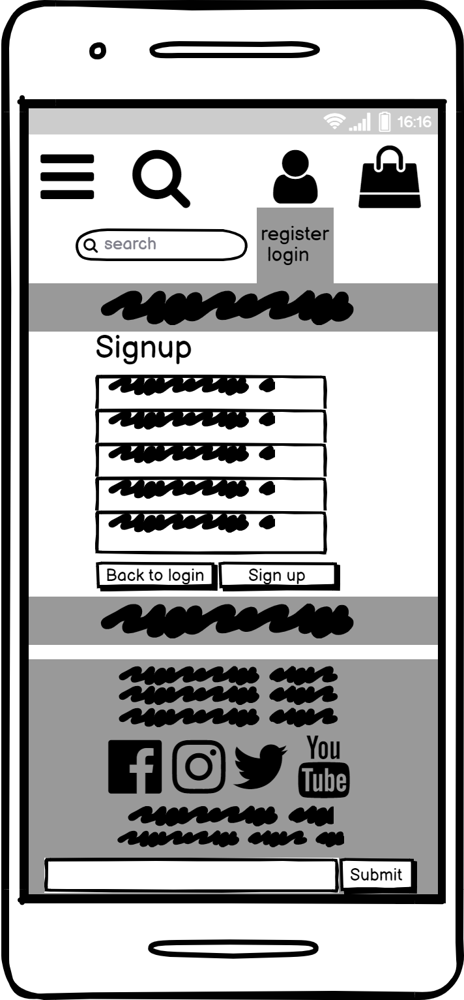
    

### Database

* Big parts of the database was inspired by the study material **Boutique Ado** from [Code Institute](https://codeinstitute.net/se/)
* Parts of the project was also built from following the **Boutique Ado** project.

* The database consists of the following models:
    * **User** / allauth
    * **UserProfile** / Boutique Ado
    * **Category** / Boutique Ado
    * **Product** / Boutique Ado
    * **Order** / Boutique Ado
    * **OrderLineItem** / Boutique Ado
    * **Wishlist** / Custom model
    * **Review** / Custom model
    * **Question** / Custom model
    

Database Diagram

#### Product Database

* I used a database of instruments from [Kaggle]( https://www.kaggle.com/datasets/lasaljaywardena/music-instrument-images-dataset) and added the products manually to the project.

## Features

* **Carousel**

* The opening of the site shows a carousel with instrument images
 

### User stories covered by this feature:

    1. As a Site Visitor I can see pictures of instruments when I enter the page so that I know what kind of page I am on.

* **Categories Nav**

* A feature was implemented to show a navbar with the instrument categories
 

### User stories covered by this feature:

    2. As a Site Visitor I can see music instrument categories so I can find the products I am interested in.

* **Product List**

* A feature was implemented to show a list of products to scroll thru
 

### User stories covered by this feature:

    3. As a Site Visitor I can scroll thru a list of products so that I can find the product I want.

* **Product Detail**

* A feature was implemented to show a single product 
 

### User stories covered by this feature:

    4. As a Site Visitor I can click on a product and see information about the product so I can get a better view of the product.

* **Sort**

* A feature was implemented so users can sort products
 

### User stories covered by this feature:

    5. As a Site Visitor I can sort products so I can find the product I want.

* **Search**

* A feature was implemented so users can search for products
 

### User stories covered by this feature:

    6. As a Site Visitor I can search for products so I can find the relevant one for me.

* **Add to bag**

* A feature was implemented so users can add products to bag
 

### User stories covered by this feature:

    7. As a Site Visitor I can add products to a bag so I can see everything I have added.
    9. As a Site Visitor I can add products to a bag so that I can buy them

* **Update and Delete products in bag**

* A feature was implemented so users can update their bag
 

### User stories covered by this feature:

    8. As a Site Visitor I can Update and Delete products in bag so I can Remove products I dont want.

* **Add, Buy products**

* A feature was implemented so users can add and buy products
 

### User stories covered by this feature:

    9. As a Site Visitor I can add products to a bag so that I can buy them
    7. As a Site Visitor I can add products to a bag so I can see everything I have added.

* **Buy Product**

* A feature was implemented so the user can buy a product.
 

### User stories covered by this feature:

    10. As a Site Visitor I can buy a product so I can get the product I want.

* **Email Confirmation**

* A feature was implemented so the user gets an email when completing an order.
 

### User stories covered by this feature:

    11. As a Site Visitor I can get an email confirmation so I can feel confident the purchase is ok.

* **Order Confirmation**

* A feature was implemented so the user gets an order confirmation when completing an order.
 

### User stories covered by this feature:

    12. As a Site Visitor I can view an order confirmation so I can feel confident everything is ok.

* **Notifications**

* A feature was implemented so the user gets notifications.
 

### User stories covered by this feature:

    13. As a Site Visitor I can browse the site and get notifications messages so I can know if things are working or not.

* **Back to top button**

* A feature was implemented so the user can get to the top of the products page when browsing the site.
 

### User stories covered by this feature:

    14. As a Site Visitor I can click on a button so that I can get to the top of the page quickly.

* **Read Reviews**

* A feature was implemented so the user can read reviews.
 

### User stories covered by this feature:

    15. As a Site Visitor I can read reviews so that I can see which products customers are happy with.

* **Account creation**

* A feature was implemented so the user can create an account.
 

### User stories covered by this feature:

    16. As a Site Visitor I can create an account so that I can have personal info saved.

* **Personal Info**

    **Requires LOGIN**

* A feature was implemented so the user can save their info.
 

### User stories covered by this feature:

    17. As a Site User I can log in to my account so that I can save my personal info.

* **Wishlist**

    **Requires LOGIN**

* A feature was implemented so the user can add a product to a wishlist.
 

### User stories covered by this feature:

    18. As a Site User I can add a product to a wishlist so that I can keep track of products I want.

* **Delete from wishlist**

    **Requires LOGIN**

* A feature was implemented so the user can delete a product from a wishlist.
 

### User stories covered by this feature:

    19. As a Site User I can delete a product from a wishlist so that I can remove products I dont want.

* **Leave Reviews**

    **Requires LOGIN**

* A feature was implemented so the user can leave reviews.
 

### User stories covered by this feature:

    20. As a Site User I can log in to my account so that I can leave reviews.

* **Delete Review**

    **Requires LOGIN**

* A feature was implemented so the user can delete their review.
 

### User stories covered by this feature:

    21. As a Site User I can Delete my Review so that I can change my review or delete it if I want to.

* **Ask Questions**

    **Requires LOGIN**

* A feature was implemented so the user can ask questions.
 

### User stories covered by this feature:

    22. As a Site User I can log in to my account so that I can Ask questions.

* **View Questions**

    **Requires LOGIN**

* A feature was implemented so the user view questions.
 

### User stories covered by this feature:

    23. As a Site User I can view questions so that I can see what other people have had to say about the site.

* **Admin Products**

    **Requires SUPERUSER**

* A feature was implemented so the admin can easily update, add and delete products from the site.
 

### User stories covered by this feature:

    24. As a Site Admin I can add, read, update and delete products so that I can manage the content.

* **Admin Checkout**

    **Requires SUPERUSER**

* A feature was implemented so the admin can see orders from the admin page.
 

### User stories covered by this feature:

    25. As a Site Admin I can see all checkout orders so that I can see what people are buying.

* **Admin Questions**

    **Requires SUPERUSER**

* A feature was implemented so the admin can control the questions.
 

### User stories covered by this feature:

    26. As a Site Admin I can create, read, update and delete questions so that I can manage my content.

* **Admin Reviews**

    **Requires SUPERUSER**

* A feature was implemented so the admin can control the reviews.
 

### User stories covered by this feature:

    27. As a Site Admin I can create, read, update and delete reviews so that I can manage my content.

* **Admin Wishlist**

    **Requires SUPERUSER**

* A feature was implemented so the admin can control the wishlists.
 

### User stories covered by this feature:

    28. As a Site Admin I can manage the wishlist so that I can keep track of the wishlists.

* **Admin Search**

    **Requires SUPERUSER**

* Features was implemented so the admin can control the site.
 
## See admin features

### User stories covered by this feature:

    29. As a Site Admin I can search for all my content so that I can find what I am interested in.

* **News letter**

* Features was implemented so Visitors can sign upp to a newsletter.
 

### User stories covered by this feature:

    30. As a Site Visitor I can sign up for a newsletter so I can get information on sales.

### Facebook

I created a facebook page for the Instrumenta web page and linked it to the site.

    
    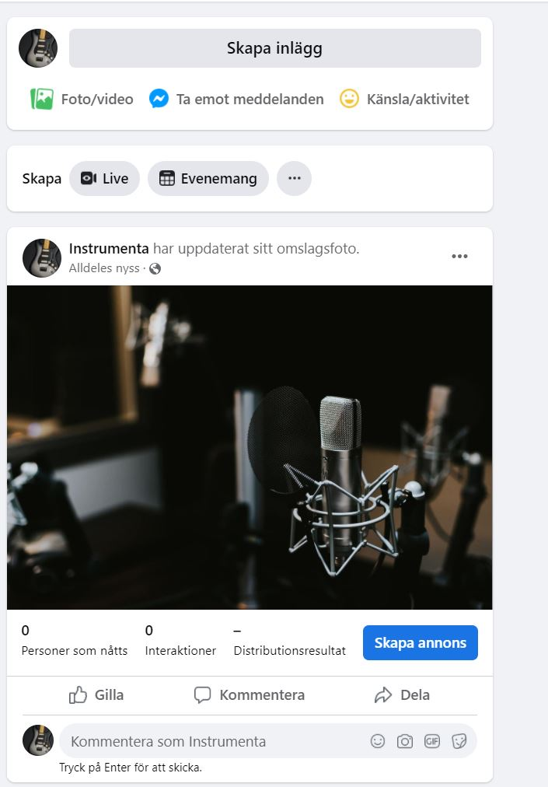
    
    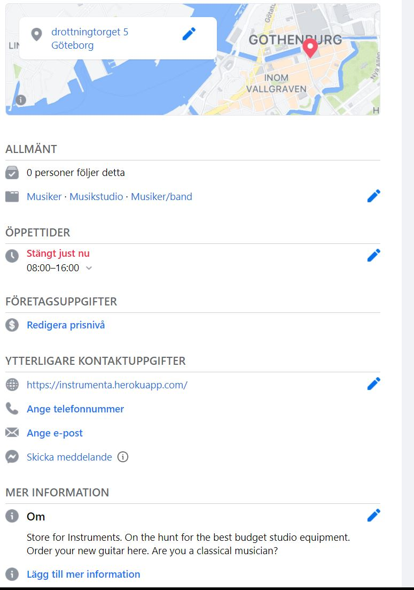
    

### Features left to implement

* In the future I would like to add another product database with better images. For the sake of time issues I used an existing database with instruments which I added manually. The downside is these images where in poor quality.

* I want to implement a feature for users to update their reviews.

* I want to implement a feature so the admin can answer users questions on question page

* I want to implement a feature for top sellers

* I want to implement a feature for best sellers

* I want to implement a feature so the user can see how many products are in their wishlist on all pages

* I want to implement a feature where if the user makes a purchase with a product from the wishlist it is removed from the wishlist

* I want to implement a feature so the users can have a bigger profile with images and more personal info to give a more personal experience on review fields

* I want to implement a feature for the delete buttons to have validation before deleting

* In the future I want to implement another newsletter service, where I can add products, sales and more.

## Technologies used

### Languages

* Python

* HTML

* CSS

* Django 3.2

* Javascript

## Libraries and programs

* [Github](https://github.com/)

* [Gitpod](https://gitpod.io/projects)

* [VS code](https://code.visualstudio.com/)

* [Bootstrap 5](https://getbootstrap.com/)

* [Heroku for deployment and storing Postgresql database](https://id.heroku.com/login)

* [Crispy forms](https://django-crispy-forms.readthedocs.io/en/latest/)

* [Balsamiq](https://balsamiq.com/)

* [Pep8 Online](http://pep8online.com/)

* [Ami responsivedesign](http://ami.responsivedesign.is/)

* [Lighthouse](https://developers.google.com/web/tools/lighthouse)

* [HTML Validator](https://validator.w3.org/)

* [CSS Validator](https://jigsaw.w3.org/css-validator/)

* [Google Fonts](https://fonts.google.com/)

* [Database diagrams](https://app.quickdatabasediagrams.com/)

* [EmailJS](https://www.emailjs.com/) was used to hook up an email service for the sites newsletter.

## Testing

### Validator testing

#### HTML

No errors were found on index.html when passing through WC3 Validator.

No errors were found on add_products.html when passing through WC3 Validator.

No errors were found on edit_product.html when passing through WC3 Validator.

No errors were found on product_detail.html when passing through WC3 Validator.

No errors were found on products.html when passing through WC3 Validator.

No errors were found on questions.html when passing through WC3 Validator.

No errors were found on wishlist.html when passing through WC3 Validator.

No errors were found on bag.html when passing through WC3 Validator.

No errors were found on checkout.html when passing through WC3 Validator.

No errors were found on checkout_success.html when passing through WC3 Validator.

No errors were found on 404.html when passing through WC3 Validator.

No errors were found on profile.html when passing through WC3 Validator.

No errors were found on reset_password.html when passing through WC3 Validator.

No errors were found on login.html when passing through WC3 Validator.

No errors were found on logout.html when passing through WC3 Validator.

No errors were found on signup.html when passing through WC3 Validator.

#### CSS

No errors were found on base.css when passing through Jigsaw W3 Validator.

No errors were found on checkout.css when passing through Jigsaw W3 Validator.

No errors were found on profile.css when passing through Jigsaw W3 Validator.

#### Python

BAG

    

No errors were found on bag_tools.py when passing through PEP8 Validator.

    
    

    

No errors were found on contexts.py when passing through PEP8 Validator.

    
    

    

No errors were found on urls.py when passing through PEP8 Validator.

    
    

    

No errors were found on views.py when passing through PEP8 Validator.

    
    

CHECKOUT

    

No errors were found on admin.py when passing through PEP8 Validator.

    
    

    

No errors were found on apps.py when passing through PEP8 Validator.

    
    

    

No errors were found on forms.py when passing through PEP8 Validator.

    
    

    

No errors were found on models.py when passing through PEP8 Validator.

    
    

    

No errors were found on signals.py when passing through PEP8 Validator.

    
    

    

No errors were found on urls.py when passing through PEP8 Validator.

    
    

    

No errors were found on views.py when passing through PEP8 Validator.

    
    

    

No errors were found on webhook_handler.py when passing through PEP8 Validator.

    
    

    

No errors were found on webhooks.py when passing through PEP8 Validator.

    
    

HOME

    

No errors were found on urls.py when passing through PEP8 Validator.

    
    

    

No errors were found on views.py when passing through PEP8 Validator.

    
    

INSTRUMENTA

    

No errors were found on settings.py when passing through PEP8 Validator.

    
    

    

No errors were found on urls.py when passing through PEP8 Validator.

    
    

PRODUCTS

    

No errors were found on admin.py when passing through PEP8 Validator.

    
    

    

No errors were found on forms.py when passing through PEP8 Validator.

    
    

    

No errors were found on models.py when passing through PEP8 Validator.

    
    

    

No errors were found on urls.py when passing through PEP8 Validator.

    
    

    

No errors were found on views.py when passing through PEP8 Validator.

    
    

    

No errors were found on widgets.py when passing through PEP8 Validator.

    
    

PROFILES

    

No errors were found on forms.py when passing through PEP8 Validator.

    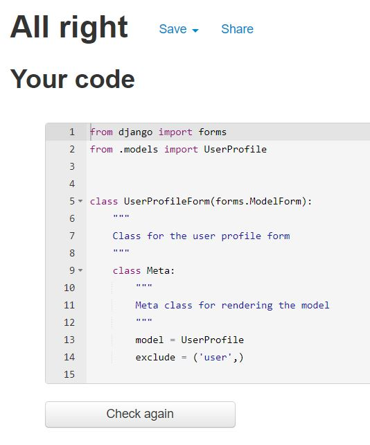
    

    

No errors were found on models.py when passing through PEP8 Validator.

    
    

    

No errors were found on urls.py when passing through PEP8 Validator.

    
    

    

No errors were found on views.py when passing through PEP8 Validator.

    
    

QUESTIONS

    

No errors were found on admin.py when passing through PEP8 Validator.

    
    

    

No errors were found on forms.py when passing through PEP8 Validator.

    
    

    

No errors were found on models.py when passing through PEP8 Validator.

    
    

    

No errors were found on urls.py when passing through PEP8 Validator.

    
    

    

No errors were found on views.py when passing through PEP8 Validator.

    
    

WISHLIST

    

No errors were found on admin.py when passing through PEP8 Validator.

    
    

    

No errors were found on models.py when passing through PEP8 Validator.

    
    

    

No errors were found on urls.py when passing through PEP8 Validator.

    
    

    

No errors were found on views.py when passing through PEP8 Validator.

    
    

No errors were found on custom_storages.py when passing through PEP8 Validator.

    
    

#### Javascript

No errors were found on bag.js when passing through jshint.

No errors were found on emailjs.js when passing through jshint.

No errors were found on products.js when passing through jshint.

No errors were found on profile.js when passing through jshint.

No errors were found on stripe_elements.js when passing through jshint.

#### Accessibility

No errors were found on the index.html when passing through Wave Web Accessibility Validator.

No errors were found on the add_product.html when passing through Wave Web Accessibility Validator.

No errors were found on the edit_product.html when passing through Wave Web Accessibility Validator.

No errors were found on the product_detail.html when passing through Wave Web Accessibility Validator.

No errors were found on the products.html when passing through Wave Web Accessibility Validator.

No errors were found on the questions.html when passing through Wave Web Accessibility Validator.

No errors were found on the wishlist.html when passing through Wave Web Accessibility Validator.

No errors were found on the bag.html when passing through Wave Web Accessibility Validator.

No errors were found on the checkout.html when passing through Wave Web Accessibility Validator.

No errors were found on the checkout_success.html when passing through Wave Web Accessibility Validator.

No errors were found on the 404.html when passing through Wave Web Accessibility Validator.

No errors were found on the profile.html when passing through Wave Web Accessibility Validator.

No errors were found on the reset_password.html when passing through Wave Web Accessibility Validator.

No errors were found on the login.html when passing through Wave Web Accessibility Validator.

No errors were found on the logout.html when passing through Wave Web Accessibility Validator.

No errors were found on the signup.html when passing through Wave Web Accessibility Validator.

#### Performance

index.html

add_products.html

edit_products.html

product_detail.html

products.html

questions.html

wishlist.html

bag.html

checkout.html

checkout_success.html

profile.html

reset_password.html

login.html

logout.html

signup.html

## Browser Compatibility

* Chrome: The website is combatible and behaves as expected.

* Firefox: The website is combatible and behaves as expected.

* Edge: The website is combatible and behaves as expected.

## Further testing

* I have tested the website on One Plus 8T

* Friends and family has been asked to review the site.

## SEO

* In the beginning of the project I made a small plan of what I thought user might want.

Small site plan

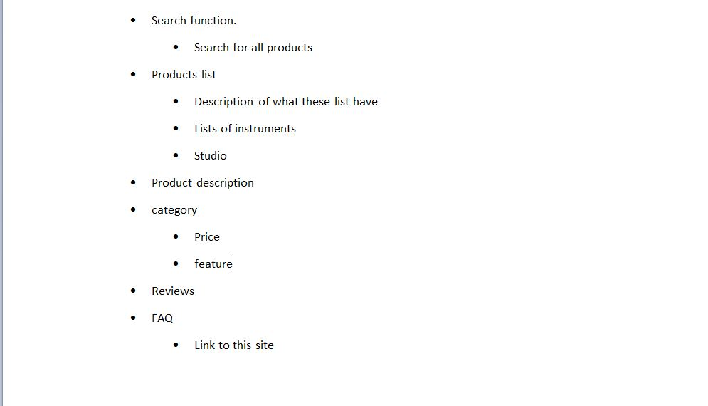
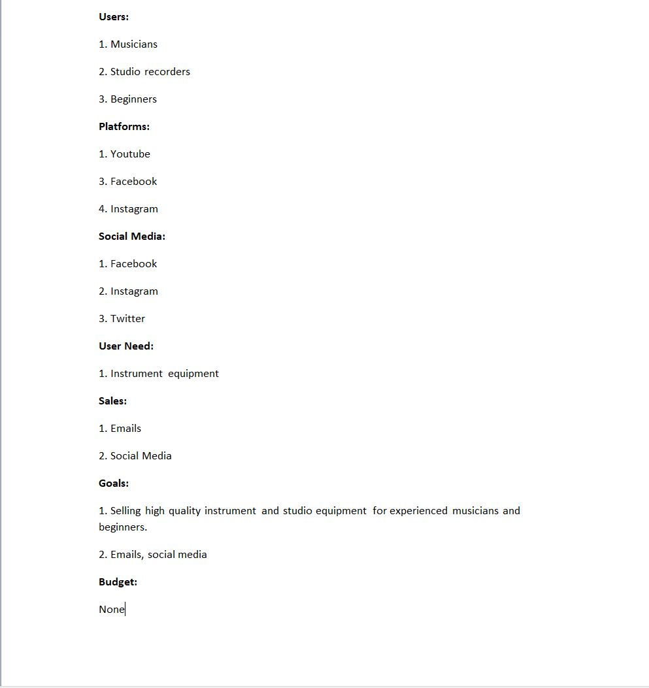

* For the keywords I looked at some phrases and words, I used [wordtracker](https://www.wordtracker.com/) to find some keywords with popularity and wasn’t to used.

SEO

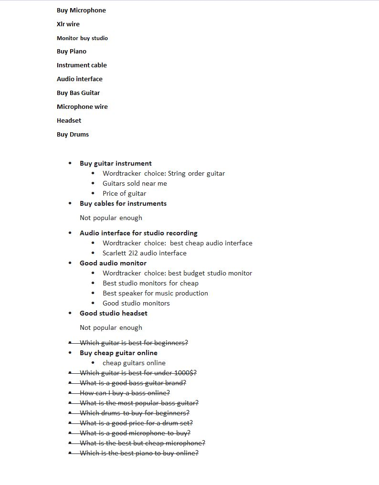
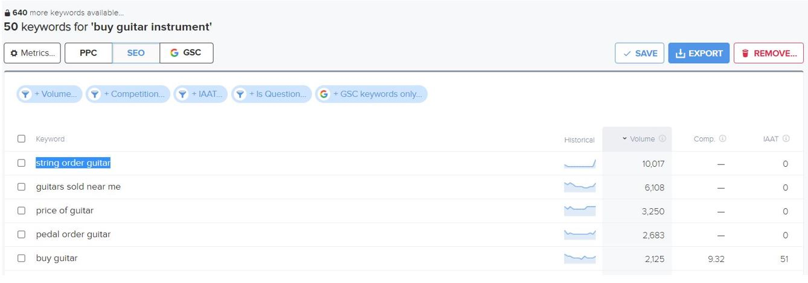
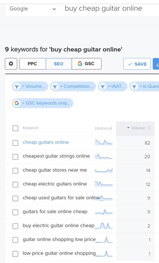
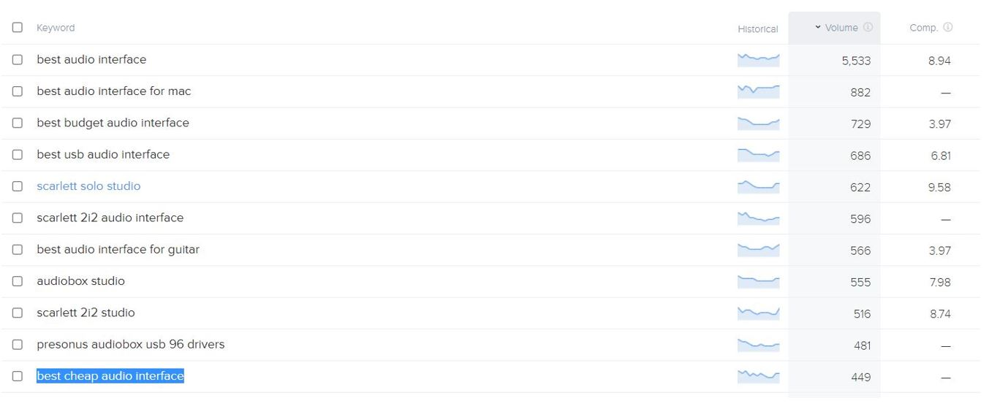
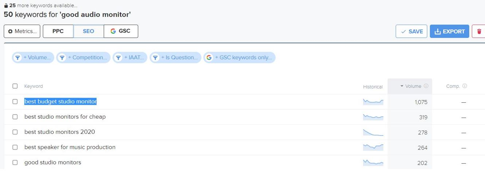

## Testing user stories

1. As a Site Visitor I can see pictures of instruments when I enter the page so that I know what kind of page I am on.

|             Feature           |        Action        |                 Expected result                    |   Actual result     |
|            :----------:       |    :------------:    |               :-----------------:                  | :---------------:   |
|  The carousel is on the home page |    arrive on home page    |       carousel will appear on home page     |  Works as expected  |

Screenshot

2. As a Site Visitor I can see music instrument categories so I can find the products I am interested in.

|             Feature           |        Action        |                 Expected result                    |   Actual result     |
|            :----------:       |    :------------:    |               :-----------------:                  | :---------------:   |
|  Categories are present in navbar  | click choosen category |      navbar will appear on every page  | Works as expected |

Screenshot

3. As a Site Visitor I can scroll thru a list of products so that I can find the product I want.

|             Feature           |        Action        |                 Expected result                    |   Actual result     |
|            :----------:       |    :------------:    |               :-----------------:                  | :---------------:   |
|  Page of products  |  Click any category | User will be taken to products page         | Works as expected   |

Screenshot

4. As a Site Visitor I can click on a product and see information about the product so I can get a better view of the product.

|             Feature           |        Action        |                 Expected result                    |   Actual result     |
|            :----------:       |    :------------:    |               :-----------------:                  | :---------------:   |
|  Product Details  |  Click on a product | User will be taken to product detail page       | Works as expected   |

Screenshot

5. As a Site Visitor I can sort products so I can find the product I want.

|             Feature           |        Action        |                 Expected result                    |   Actual result     |
|            :----------:       |    :------------:    |               :-----------------:                  | :---------------:   |
|  sorting button  |  click on button and choose sorting | products will be sorted         | Works as expected   |

Screenshot

6. As a Site Visitor I can search for products so I can find the relevant one for me.

|             Feature           |        Action        |                 Expected result                    |   Actual result     |
|            :----------:       |    :------------:    |               :-----------------:                  | :---------------:   |
|  Search bar  |  search for product | User will be taken to products page with products found         | Works as expected   |

Screenshot

7. As a Site Visitor I can add products to a bag so I can see everything I have added.

|             Feature           |        Action        |                 Expected result                    |   Actual result     |
|            :----------:       |    :------------:    |               :-----------------:                  | :---------------:   |
|  Add to bag  |  Click on product > click on add to bag | product will be added to bag         | Works as expected   |

Screenshot

8. As a Site Visitor I can Update and Delete products in bag so I can Remove products I dont want.

|             Feature           |        Action        |                 Expected result                    |   Actual result     |
|            :----------:       |    :------------:    |               :-----------------:                  | :---------------:   |
|  Update and remove products  | Go to checkout > Click on update to update quantity, click on remove to remove | User will be taken to products page   | Works as expected   |

Screenshot

9. As a Site Visitor I can add products to a bag so that I can buy them

|             Feature           |        Action        |                 Expected result                    |   Actual result     |
|            :----------:       |    :------------:    |               :-----------------:                  | :---------------:   |
|  Add to bag  |  Click on product > click on add to bag | product will be added to bag         | Works as expected   |

Screenshot

10. As a Site Visitor I can buy a product so I can get the product I want.
11. As a Site Visitor I can get an email confirmation so I can feel confident the purchase is ok.
12. As a Site Visitor I can view an order confirmation so I can feel confident everything is ok.

|             Feature           |        Action        |                 Expected result                    |   Actual result     |
|            :----------:       |    :------------:    |               :-----------------:                  | :---------------:   |
|  checkout  |  add product to bag > click on checkout > click secure checkout > fill out delivery info > click complete order | order will be processed, user will get email conf, and come to order conf         | Works as expected   |
|  email confirmation  |  complete an order | User will get an email confirmation         | Works as expected   |
|  order confirmation  |  complete an order | User will be redirected to order confirmation         | Works as expected   |

Screenshot

13. As a Site Visitor I can browse the site and get notifications messages so I can know if things are working or not.

|             Feature           |        Action        |                 Expected result                    |   Actual result     |
|            :----------:       |    :------------:    |               :-----------------:                  | :---------------:   |
|  notifications  |  add to bag, edit, remove | User will get a notification         | Works as expected   |

Screenshot

14. As a Site Visitor I can click on a button so that I can get to the top of the page quickly.

|             Feature           |        Action        |                 Expected result                    |   Actual result     |
|            :----------:       |    :------------:    |               :-----------------:                  | :---------------:   |
|  Back to top button  |  Click button | User will be taken to top of page         | Works as expected   |

Screenshot

15. As a Site Visitor I can read reviews so that I can see which products customers are happy with.

|             Feature           |        Action        |                 Expected result                    |   Actual result     |
|            :----------:       |    :------------:    |               :-----------------:                  | :---------------:   |
|  Reviews on products  |  Go to product detail > scroll down | User will find reviews or no reviews        | Works as expected   |

Screenshot

16. As a Site Visitor I can create an account so that I can have personal info saved.

|             Feature           |        Action        |                 Expected result                    |   Actual result     |
|            :----------:       |    :------------:    |               :-----------------:                  | :---------------:   |
|  Create account  |  Go to signup > fill out the form > verify email > confirm email | User will now have an account        | Works as expected   |

Screenshot

17. As a Site User I can log in to my account so that I can save my personal info.

* **Requires log in**

|             Feature           |        Action        |                 Expected result                    |   Actual result     |
|            :----------:       |    :------------:    |               :-----------------:                  | :---------------:   |
|  Personal info  |  when logged in click my profile  > fill out the form > click update information | User will now have saved personal info        | Works as expected   |

Screenshot

18. As a Site User I can add a product to a wishlist so that I can keep track of products I want.

* **Requires log in**

|             Feature           |        Action        |                 Expected result                    |   Actual result     |
|            :----------:       |    :------------:    |               :-----------------:                  | :---------------:   |
|  add to wishlist |  go to product detail > click add to wishlist        |          product now added to wishlist  |   Works as expected |

Screenshot

* **If not logged in**

|             Feature           |        Action        |                 Expected result                    |   Actual result     |
|            :----------:       |    :------------:    |               :-----------------:                  | :---------------:   |
|  add to wishlist |  wishlist not present in nav                  |          Visitor will not see wishlist button  |   Works as expected |
|  add to wishlist button |  wishlist button not present in product detail                  |          Visitor will not see wishlist button  |   Works as expected |

Screenshot

19. As a Site User I can delete a product from a wishlist so that I can remove products I dont want.

* **Requires log in**

|             Feature           |        Action        |                 Expected result                    |   Actual result     |
|            :----------:       |    :------------:    |               :-----------------:                  | :---------------:   |
|   delete from wishlist      |  go to wishlist > click delete from wishlist  |   product will be removed from wishlist  | Works as expected   |

Screenshot

* **If not logged in**

|             Feature           |        Action        |                 Expected result                    |   Actual result     |
|            :----------:       |    :------------:    |               :-----------------:                  | :---------------:   |
|   delete from wishlist      |  Fill out wishlist url  |  Visitor will be redirected to login page                | Works as expected   |

Screenshot

20. As a Site User I can log in to my account so that I can leave reviews.

* **Requires log in**

|             Feature           |        Action        |                 Expected result                    |   Actual result     |
|            :----------:       |    :------------:    |               :-----------------:                  | :---------------:   |
|   review underneath product   |   go to product_detail > scroll down > fill out form  |  the review will be posted underneath product  |  Works as expected  |

Screenshot

* **If not logged in**

|             Feature           |        Action        |                 Expected result                    |   Actual result     |
|            :----------:       |    :------------:    |               :-----------------:                  | :---------------:   |
|   review underneath product   |   go to product_detail > scroll down > fill out form  |  Visitor will not see form  but links to register and sign in |  Works as expected  |

Screenshot

21. As a Site User I can Delete my Review so that I can change my review or delete it if I want to.

* **Requires log in**

|             Feature           |        Action        |                 Expected result                    |   Actual result     |
|            :----------:       |    :------------:    |               :-----------------:                  | :---------------:   |
|  delete review  |   click on delete review  |   review will be removed  | Works as expected   |

Screenshot

* **If not logged in**

|             Feature           |        Action        |                 Expected result                    |   Actual result     |
|            :----------:       |    :------------:    |               :-----------------:                  | :---------------:   |
|   delete review   |   click on delete review  |  Visitor will not see delete review button |  Works as expected  |

Screenshot

22. As a Site User I can log in to my account so that I can Ask questions.
23. As a Site User I can view questions so that I can see what other people have had to say about the site.

* **Requires log in**

|             Feature           |        Action        |                 Expected result                    |   Actual result     |
|            :----------:       |    :------------:    |               :-----------------:                  | :---------------:   |
|  form for asking questions |    click questions button > scroll down > fill out form    |     Question will appear top of the screen    |   Works as expected |
|  page with questions |    click questions button    |     Questions will appear on the screen    |   Works as expected |

Screenshot

* **If not logged in**

|             Feature           |        Action        |                 Expected result                    |   Actual result     |
|            :----------:       |    :------------:    |               :-----------------:                  | :---------------:   |
|   question button in nav   |   click question button  |  Visitor will not see question button |  Works as expected  |
|   question url   |   Fill out url  |  Visitor will be redirected to signin page |  Works as expected  |

Screenshot

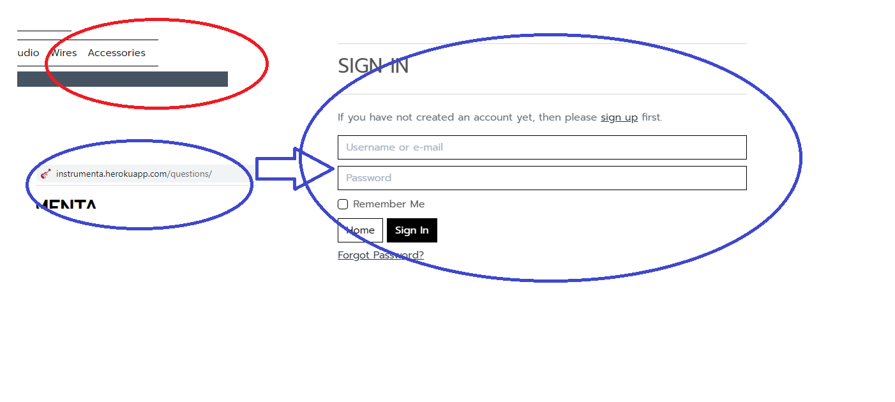

24. As a Site Admin I can add, read, update and delete products so that I can manage the content.

* **Requires admin**

|             Feature           |        Action        |                 Expected result                    |   Actual result     |
|            :----------:       |    :------------:    |               :-----------------:                  | :---------------:   |
|  Create product   | click my account > click product management > Fill out form > click add product   |  admin will be redirected to product detail page with new product  |   Works as expected |
|  Edit product   |  on products page > click edit on a product > edit change > click update product | admin will be redirected to product detail page with updated product    |   Works as expected |
|  Delete product   |  any product site > click delete  |      product will be deleted          |   Works as expected |

Screenshot

* **If not admin**

|             Feature           |        Action        |                 Expected result                    |   Actual result     |
|            :----------:       |    :------------:    |               :-----------------:                  | :---------------:   |
|  add product url   | Fill out url    |  user will be taken to login page  |   Works as expected |
|  Edit product url   |  Fill out url    |  user will be taken to login page    |   Works as expected |
|  Delete product url   |  Fill out url    |  user will be taken to login page          |   Works as expected |

Screenshot

25. As a Site Admin I can see all checkout orders so that I can see what people are buying.

* **Requires admin**

|             Feature           |        Action        |                 Expected result                    |   Actual result     |
|            :----------:       |    :------------:    |               :-----------------:                  | :---------------:   |
|  Checkout admin   |  Log in to admin site > click orders  |  orders will appear  |   Works as expected |

Screenshot

26. As a Site Admin I can create, read, update and delete questions so that I can manage my content.

* **Requires admin**

|             Feature           |        Action        |                 Expected result                    |   Actual result     |
|            :----------:       |    :------------:    |               :-----------------:                  | :---------------:   |
|  Create question   |  Log in to admin site > click question > add question > Fill out form > save  |  Question will appear at the top  |   Works as expected |
|  Read question   |  Log in to admin site > click question > choose question |      Whole question will appear           |   Works as expected |
|  Update question   |  Log in to admin site > click question > choose question > update question > save  |      Question will be updated           |   Works as expected |
|  Delete question   |  Log in to admin site > click question > choose question > delete question > delete  |      Question will be deleted          |   Works as expected |

Screenshot

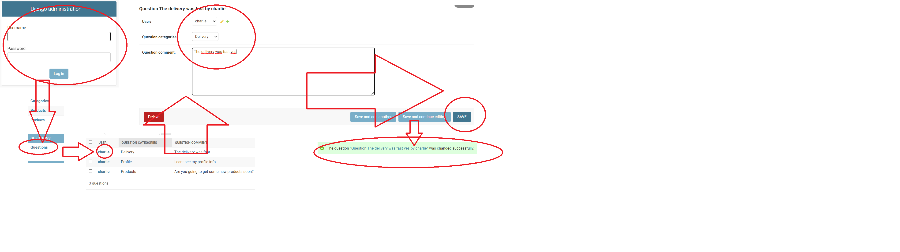

27. As a Site Admin I can create, read, update and delete reviews so that I can manage my content.

* **Requires admin**

|             Feature           |        Action        |                 Expected result                    |   Actual result     |
|            :----------:       |    :------------:    |               :-----------------:                  | :---------------:   |
|  Create reviews   |  Log in to admin site > click reviews > add reviews > Fill out form > save  |  reviews will appear at the top  |   Works as expected |
|  Read reviews   |  Log in to admin site > click reviews > choose reviews |      Whole reviews will appear           |   Works as expected |
|  Update reviews   |  Log in to admin site > click reviews > choose reviews > update reviews > save  |      reviews will be updated           |   Works as expected |
|  Delete reviews   |  Log in to admin site > click reviews > choose reviews > delete reviews > delete  |      reviews will be deleted          |   Works as expected |

Screenshot

28. As a Site Admin I can manage the wishlist so that I can keep track of the wishlists.

* **Requires admin**

|             Feature           |        Action        |                 Expected result                    |   Actual result     |
|            :----------:       |    :------------:    |               :-----------------:                  | :---------------:   |
|  Create wishlist   |  Log in to admin site > click wishlist > add wishlist > choose user and products > save  |  wishlist will appear at the top  |   Works as expected |
|  Read wishlist   |  Log in to admin site > click wishlist > choose wishlist |      wishlist will appear and products will be greyed out           |   Works as expected |
|  Update wishlist   |  Log in to admin site > click wishlist > choose wishlist > update wishlist > save  |      wishlist will be updated           |   Works as expected |
|  Delete wishlist   |  Log in to admin site > click wishlist > choose wishlist > delete wishlist > delete  |      wishlist will be deleted          |   Works as expected |

Screenshot

29. As a Site Admin I can search for all my content so that I can find what I am interested in.

* **Requires admin**

|             Feature           |        Action        |                 Expected result                    |   Actual result     |
|            :----------:       |    :------------:    |               :-----------------:                  | :---------------:   |
|  Search   |  Log in to admin site > click model > search in search bar or filter  |  Relevant content will appear  |   Works as expected |

Screenshot

30. As a Site Visitor I can sign up for a newsletter so I can get information on sales.

* **Requires admin**

|             Feature           |        Action        |                 Expected result                    |   Actual result     |
|            :----------:       |    :------------:    |               :-----------------:                  | :---------------:   |
|  newsletter   |  on any site scroll down to footer > fill out email > click signup  |  visitor will get an email  |   Works as expected |

Screenshot

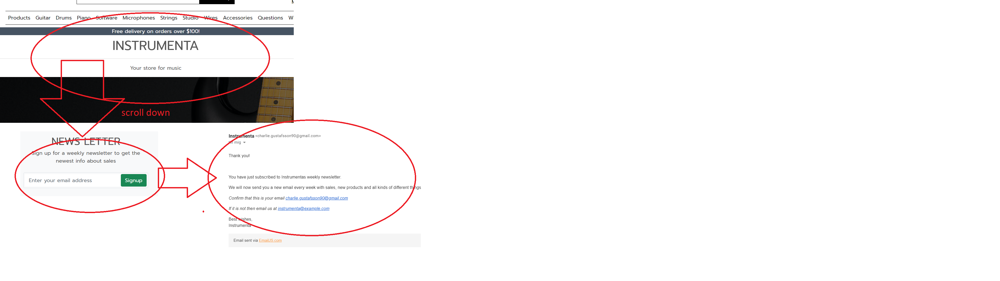

## API

* Gmail SMTP

    1. Create google account

    2. Go to account settings, click accounts and import, other google account settings

    3. Go to security and click 2-step verification

    4. Get started, enter password and select verification method and verify

    5. Click app passwords, login again

    6. Select mail, device type and enter the name you want

    7. Copy password

    * Add variables to env and heroku

    8. Add variable EMAIL_HOST_PASS with the password

    9. Add variable EMAIL_HOST_USER with your email as value

    10. Add following variables to settings.py

    * if 'DEVELOPMENT' in os.environ:
        * EMAIL_BACKEND = 'django.core.mail.backends.console.EmailBackend'
        * DEFAULT_FROM_EMAIL = 'instrumenta@example.com'
    * else:
        * EMAIL_BACKEND = 'django.core.mail.backends.smtp.EmailBackend'
        * EMAIL_USE_TLS = True
        * EMAIL_PORT = 587
        * EMAIL_HOST = 'smtp.gmail.com'
        * EMAIL_HOST_USER = os.environ.get('EMAIL_HOST_USER')
        * EMAIL_HOST_PASSWORD = os.environ.get('EMAIL_HOST_PASS')
        * DEFAULT_FROM_EMAIL = os.environ.get('EMAIL_HOST_USER')

* EmailJS

    1. Create an account on EmailJS

    2. Add a new email service.

    3. Create an email template with the wanted variables.

    4. Add a link to js and add Javascript in the emailjs.js.

## Bugs

* **Bug:** Django took base.html from allauth instead of the top base.html.

    * **Fix:** Remove blank space before file name.

* **Bug:** Footer was overlapping content.

    * **Fix:** Removed Bootstrap class fixed-footer.

* **Bug:** Site would not open.

    * **Fix:** Fixed typo in bag/urls.py from name=view to name=view_bag.

* **Bug:** Module not found, could not open server.

    * **Fix:** Fixed typo in context.py to contexts.py.

* **Bug:** Background in navbar would not cover the navbar when scrolling.

    **Fix:** Added constant white background to navbar.

* **Bug:** The grand total, bag total and delivery was not updating correctly.
    
    **Fix:** I changed the calculation in contexts.py from adding to multiplying *total += quantity * product.price*

* **Bug:** The body went underneath the header.
    
    **Fix:** I added a missing closing bracket in base.css.

* **Bug:** Site would not deploy correctly.
    
    **Fix:** I added a missing closing bracket for sql database.

* **Bug:** Content was overflowing on x axis.
    
    **Fix:** I added a parent div for banner under content with classes, **container-fluid** and **w-100**.

### Known bugs

* There is a bug in both the question form and the review form where the text*Field is required* shows up. 

## Deployment

### Deploying to Heroku

1. Use **pip3 freeze > requirements.txt** in terminal to save libraries that needs to be installed on Heroku as well.

2. Create **Procfile** and add **web: gunicorn instrumenta.wsgi**

3. Log in to Heroku.

4. Click on the **new** button in the top right corner and in the drop down menu choose **Create new app**.

5. Choose a name for the app and a region and click **Create app**.

6. Go to the **resources** tab and go to **add-ons**, search for **postgres** and add **heroku postgres**.

7. Go to the **settings** tab and go to **Config Vars**, click **Reveal Config Vars** and copy the DATABASE_URL**VALUE**. Add **DATABASE_URL** and **VALUE** to env in the code.

8. Add **SECRET_KEY** and **VALUE** to **Config Vars** and add to env in code.

9. Add **DATABASES** in settings.py to fork with heroku database

10. Write python3 manage.py migrate in terminal

11. Add url in settings.py on **ALLOWED_HOSTS**

12. Go to the **deploy** tab and pick **GitHub** as deployment method.

13. Search for a repository and connect to it.

14. Click the button **enable automatic deploys** and then the button **deploy branch**.

15. Wait for the app to build and then click the **view** button.

### Forking a repository

1. Log in to Github.
2. Find the repository.
3. In the top right corner click the fork button.
4. Now you will have a copy of the repository in your account.

### Cloning a repository
1. Log in to Github.
2. Find the repository.
3. Above the file window locate the green code button and click it.
4. To clone the repository using https copy the link.
5. Open Git bash.
6. Change the current directory to where you want the repository cloned.
7. In your terminal type now type “Git clone” followed by the repository you copied.
8. Press Enter.
9. Done.

### [AWS](https://aws.amazon.com/) File storage

1. Create AWS account

2. Click AWS management console

3. Search for service S3

4. Create Bucket

5. Choose name

6. Uncheck block public access and acknowledge bucket public access

7. Create bucket

8. Click bucket

9. In properties tab, turn on static website hosting and set index.html and error.html

10. In permissions tab, go to CORS config and set the following configuration
 

11. Go to permissions and click generate policy generator.

12. Select S3 bucket policy, principal: *, AWS service: amazon s3, actions: getobject, copy the bucket policy editor ARN and paste it in the ARN.

13. Add statement, generate policy and copy the policy into the bucket policy editor, add a slash star at the end of resourse and save.

14. In permissions choose Access control list and edit, then check box public access.

15. Go to *services* choose IAM.

16. Create user group and choose name.

17. Create new policy

18. Import policy AmazonS3FullAccess, get the bucket ARN from S3 and copy it into JSON: resource as a list, one as is and one with a trailing /*.

19. Give policy a name and description and create policy.

20. Under permissions click user groups and click attach policies, select the choosen policy and add permissions.

21. Go to users, create user, give programmatic access and add to group.

22. Download csv file and hook up access keys to env and heroku.

23. Install boto3 and django-storages to the project 

24. Then add the following to settings.py

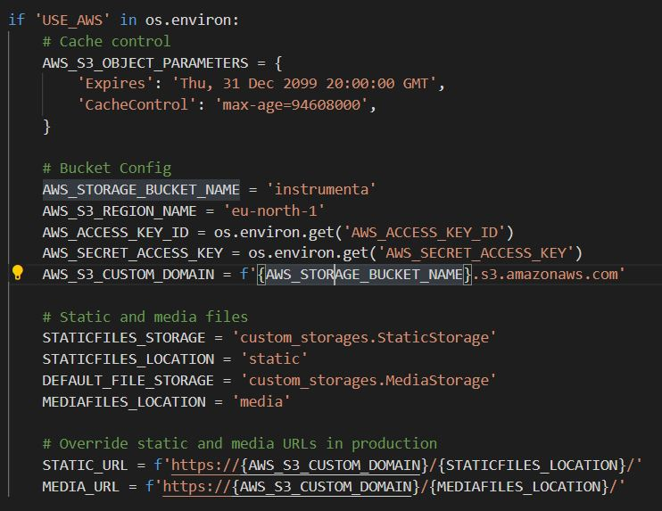

### [Stripe](https://stripe.com/se) Payment

1. Create an account

2. Go to developers

3. Then API keys

4. Copy Publishable key and Secret key to env in project and Heroku

5. Go to Webhooks

6. Add endpoint for your url and add /checkout/wh/ at the end

7. Select listeners

8. Copy the webhook secret in to project env and Heroku

## Credit

### Numerous videos, sites and articles was used to create this site.

* [This video was used for building rating and comments](https://www.youtube.com/watch?v=OvTs8BMLb7o). 
[This video was also used](https://www.youtube.com/watch?v=MZwKoi0wu2Q). 
[This site was used for the checkboxes](https://cdf.9vo.lt/1.11/django.forms.widgets/RadioSelect.html). 

* [Form rendering was a help from this site](https://simpleisbetterthancomplex.com/tutorial/2018/11/28/advanced-form-rendering-with-django-crispy-forms.html#custom-crispy-field)

## Acknowledgement

* My Mentor Mo has been invaluable, he pushed me to challenge myself and he was able to provide consistent and helpful feedback throughout my project.
